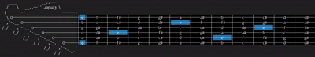
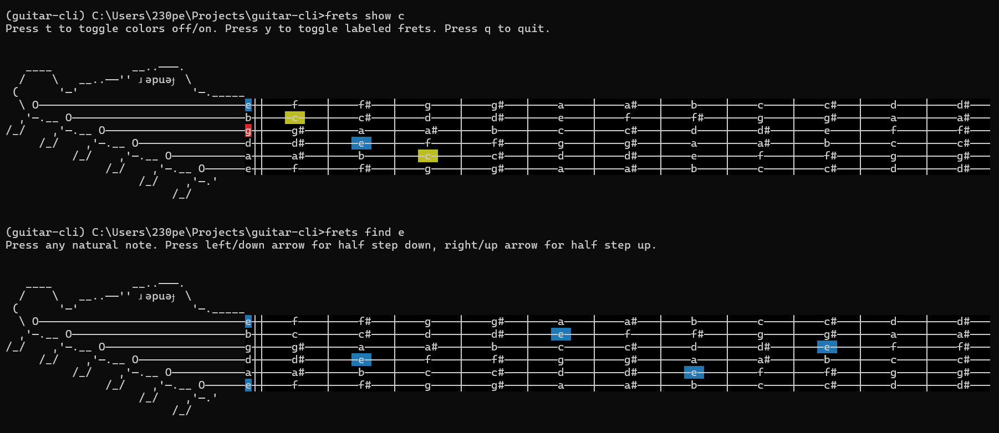

# frets
CLI for visualizing guitar chords, finding notes, and more

## running this locally
- `uv venv`
- `.venv/Scripts/activate`
- `uv sync` or `uv sync --extra dev` (for pre-commit tools)
- `uv pip install -e .`
- `frets show c`
